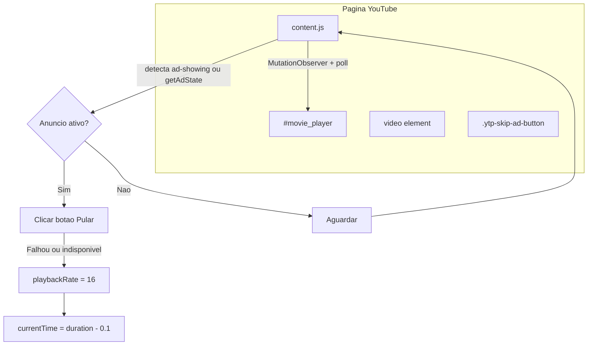
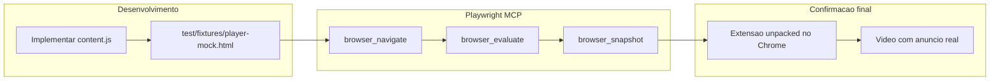

# Plano: Extensão Chrome para pular anúncios do YouTube

## Contexto

O repositório está vazio — apenas [`README.md`](README.md). Toda a extensão será criada do zero.

## Arquitetura

A extensão será **content-script only** (sem background worker no MVP). O script roda em todas as páginas `youtube.com`, observa o player de vídeo e reage quando um anúncio começa.



## Estratégia de detecção

Usar **dois sinais redundantes** (YouTube muda o DOM com frequência):

1. **Classe CSS** — o player recebe `ad-showing` durante anúncios:
   ```js
   document.querySelector('.html5-video-player')?.classList.contains('ad-showing')
   ```

2. **API interna do player** — método disponível no elemento `#movie_player`:
   ```js
   document.getElementById('movie_player')?.getAdState?.() === 1
   ```

Um loop leve (`requestAnimationFrame` ou `setInterval` ~250ms) + `MutationObserver` no container do player garante detecção rápida sem polling pesado.

## Estratégia de skip (em camadas)

Quando anúncio detectado, aplicar na ordem:

| Prioridade | Ação | Quando |
|---|---|---|
| 1 | Clicar `.ytp-skip-ad-button` ou `.ytp-ad-skip-button-modern` | Botão visível e habilitado |
| 2 | `video.playbackRate = 16` | Anúncio não-pulável (espera os 5s obrigatórios acelerados) |
| 3 | `video.currentTime = video.duration - 0.1` | Quando `duration` é finito e > 0 |

Quando o anúncio termina (`ad-showing` some), **restaurar** `playbackRate = 1` no vídeo principal.

## Estrutura de arquivos proposta

```
youtube-ad-skipper/
├── manifest.json          # Manifest V3
├── src/
│   ├── content.js         # Lógica principal (detecção + skip)
│   └── constants.js       # Seletores CSS e intervalos (fácil de atualizar)
├── test/
│   └── fixtures/
│       └── player-mock.html   # Player fake para validação via Playwright MCP
├── icons/
│   ├── icon16.png
│   ├── icon48.png
│   └── icon128.png
└── README.md              # Instalação + como funciona
```

**Stack:** JavaScript vanilla, sem build step — carrega direto via "Load unpacked" no Chrome.

## manifest.json (essencial)

```json
{
  "manifest_version": 3,
  "name": "YouTube Ad Skipper",
  "version": "1.0.0",
  "description": "Pula anúncios do YouTube automaticamente",
  "permissions": [],
  "host_permissions": ["*://*.youtube.com/*"],
  "content_scripts": [{
    "matches": ["*://*.youtube.com/*"],
    "js": ["src/constants.js", "src/content.js"],
    "run_at": "document_idle"
  }],
  "icons": {
    "16": "icons/icon16.png",
    "48": "icons/icon48.png",
    "128": "icons/icon128.png"
  }
}
```

Sem permissões especiais além de `host_permissions` — tudo roda no contexto da página.

## Lógica principal em `src/content.js`

```js
// Pseudocódigo da estrutura
let isAdActive = false;

function detectAd() {
  const player = document.querySelector('.html5-video-player');
  const adState = document.getElementById('movie_player')?.getAdState?.();
  return player?.classList.contains('ad-showing') || adState === 1;
}

function skipAd() {
  // 1. Tentar clicar botão pular
  const skipBtn = document.querySelector('.ytp-skip-ad-button, .ytp-ad-skip-button-modern');
  if (skipBtn && skipBtn.offsetParent !== null) {
    skipBtn.click();
    return;
  }
  // 2. Acelerar + seek
  const video = document.querySelector('.html5-main-video');
  if (!video) return;
  video.playbackRate = 16;
  if (video.duration && isFinite(video.duration)) {
    video.currentTime = video.duration - 0.1;
  }
}

function tick() {
  const adNow = detectAd();
  if (adNow && !isAdActive) isAdActive = true;
  if (adNow) skipAd();
  if (!adNow && isAdActive) {
    isAdActive = false;
    restorePlaybackRate();
  }
  requestAnimationFrame(tick); // ou setInterval
}
```

**SPA navigation:** YouTube é SPA — escutar eventos `yt-navigate-finish` no `document` para reinicializar o observer quando a URL muda sem reload.

## Constantes centralizadas em `src/constants.js`

```js
export const SELECTORS = {
  player: '.html5-video-player',
  moviePlayer: '#movie_player',
  skipButton: '.ytp-skip-ad-button, .ytp-ad-skip-button-modern',
  video: '.html5-main-video',
};
export const PLAYBACK_RATE = 16;
export const POLL_INTERVAL_MS = 250;
```

(Vanilla JS usará objetos globais em vez de `export` — ou IIFE compartilhada.)

## Ícones

Gerar ícones simples (16/48/128px) — pode ser um SVG convertido ou PNG placeholder mínimo para passar na validação do Chrome Web Store futuramente.

## README atualizado

Incluir:
- Como instalar (chrome://extensions → Developer mode → Load unpacked)
- Como funciona (detecção + estratégias)
- Limitações conhecidas (YouTube pode mudar seletores; anúncios patrocinados na sidebar não são afetados)
- Nota sobre termos de uso do YouTube

## Limitações e riscos

- **DOM instável:** YouTube atualiza seletores periodicamente — manter seletores em `constants.js` facilita manutenção.
- **Anúncios overlay/banner:** Esta abordagem cobre pre-roll e mid-roll no player; overlays laterais (`ytd-ad-slot-renderer`) ficam fora do escopo inicial.
- **Anúncios patrocinados no feed:** Não são vídeos — não serão afetados (comportamento esperado).
- **YouTube Premium:** Se o usuário não tem anúncios, o script não faz nada (detecção retorna falso).

## Validação com Playwright MCP

O projeto tem o MCP **Playwright** (`user-Playwright`) disponível no Cursor. Será usado durante o desenvolvimento para reduzir tentativa-e-erro com o DOM instável do YouTube.

### O que o MCP cobre bem

| Ferramenta | Uso no projeto |
|---|---|
| `browser_navigate` | Abrir `youtube.com/watch?v=...` e inspecionar o player |
| `browser_snapshot` | Capturar estrutura do DOM e confirmar seletores (`.ad-showing`, botão pular, `#movie_player`) |
| `browser_evaluate` | Rodar no contexto da página: `getAdState()`, classes do player, `playbackRate` do vídeo |
| `browser_take_screenshot` | Evidência visual de estados do player |
| `browser_run_code_unsafe` | Scripts Playwright avançados (ex.: abrir contexto com extensão carregada via `--load-extension`) |

### Fluxo de validação durante a implementação



1. **Página mock local** — criar [`test/fixtures/player-mock.html`](test/fixtures/player-mock.html) que replica a estrutura mínima do player YouTube (`.html5-video-player`, `.html5-main-video`, botão skip, toggle de `ad-showing`). O content script pode ser injetado manualmente ou via `file://` + extensão.
2. **Inspeção no YouTube real** — usar MCP para navegar a um vídeo e validar que os seletores em `constants.js` ainda existem no DOM atual.
3. **Verificação de lógica** — via `browser_evaluate`, simular estado de anúncio na página mock e checar se `playbackRate` muda e se o clique no botão é disparado.
4. **Teste com extensão (opcional)** — `browser_run_code_unsafe` pode lançar Chromium com:
   ```js
   args: [
     `--disable-extensions-except=${extensionPath}`,
     `--load-extension=${extensionPath}`,
   ]
   ```
   Isso permite E2E automatizado se o MCP expuser controle do launch context.

### Limitações importantes

- **Anúncios reais são não-determinísticos** — dependem de conta sem Premium, região, targeting. O MCP não garante que um vídeo específico exibirá anúncio a cada execução.
- **Confirmação final continua manual** — carregar extensão unpacked no Chrome do usuário e testar com anúncio real permanece obrigatório.
- **O mock cobre a lógica; o YouTube cobre os seletores** — combinar os dois reduz risco sem depender só de ads reais.

## Teste manual (confirmação final)

1. Carregar extensão unpacked no Chrome
2. Abrir um vídeo com anúncio (conta sem Premium, modo anônimo)
3. Verificar: anúncio skippable → clique automático; não-skippable → acelera e termina em ~1s
4. Navegar para outro vídeo (SPA) → continua funcionando
5. Verificar que `playbackRate` volta a 1 após o anúncio

## Evoluções futuras (fora do escopo inicial)

- Suite Playwright formal no repo (`package.json` + `tests/e2e/`) espelhando o que o MCP valida
- Popup com toggle on/off (`chrome.storage` + `action` popup)
- TypeScript + Vite se o projeto crescer
- Opção configurável de segundos de seek
- Suporte a `youtube.com/embed/*` e YouTube Music
